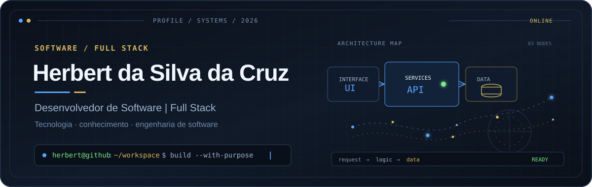

<div align="center">



# Herbert da Silva da Cruz

**Desenvolvedor de Software | Full Stack**

[](https://herbertsdev.github.io/herbert-portfolio/)
[](https://www.linkedin.com/in/herbert-da-silva-da-cruz-b001942b0/)
[](mailto:herbertdasilvadacruz@outlook.com)

</div>

```text
herbert@github:~/workspace$ status --resumo

foco       desenvolvimento de software, APIs, interfaces e bancos de dados
formação   Análise e Desenvolvimento de Sistemas · Mackenzie · 2º/5 semestres
objetivo   oportunidade de estágio em desenvolvimento de software
modo       aprender → construir → documentar → evoluir
```

## Painel do perfil

| Sinal | Informação |
| :--- | :--- |
| **Usuário** | Herbert da Silva da Cruz |
| **Localização** | São Paulo, SP, Brasil |
| **Formação** | Análise e Desenvolvimento de Sistemas |
| **Instituição** | Universidade Presbiteriana Mackenzie |
| **Atuação** | Desenvolvimento Full Stack |
| **Interesses** | Back-end, interfaces web, APIs, bancos de dados e aplicativos móveis |
| **GitHub** | [@HerbertsDev](https://github.com/HerbertsDev) |

## Sobre mim

Sou estudante de Análise e Desenvolvimento de Sistemas e transformo aprendizado em software: APIs, interfaces web e bancos de dados construídos com clareza, organização e atenção à experiência de quem usa.

Minha trajetória também inclui suporte técnico e de redes, investigação de incidentes, atendimento a usuários e comunicação entre equipes. Essa base reforçou meu olhar para confiabilidade, documentação e resolução de problemas. Hoje, desenvolvo projetos de back-end, front-end, banco de dados e prototipação de interfaces enquanto busco uma oportunidade de estágio em desenvolvimento de software.

## Stack tecnológica

### Aplicada em projetos e experiências documentadas


### Conhecimentos e estudos complementares


> As tecnologias estão separadas entre aplicação em projetos ou experiências documentadas e repertório de estudos complementares. Badges não representam nível de proficiência.

## Projetos em destaque

### [Portfólio profissional](https://github.com/HerbertsDev/herbert-portfolio) · publicado

Aplicação Angular responsiva para apresentar trajetória, projetos e formação. Inclui terminal animado, navegação acessível, suporte a movimento reduzido, testes de interface com Playwright e publicação automática no GitHub Pages.

`Angular` `TypeScript` `SCSS` `RxJS` `Playwright` `GitHub Actions`

[Ver aplicação](https://herbertsdev.github.io/herbert-portfolio/) · [Ver repositório](https://github.com/HerbertsDev/herbert-portfolio)

### Payment Orchestration Layer · experiência por projeto

Componentes de back-end e APIs REST para fluxos de pagamento, desenvolvidos durante um programa prático remoto da Zetheta Algorithms. O trabalho envolveu implementação, organização de entregáveis e documentação técnica. O código não possui repositório público.

`Python` `FastAPI` `SQL` `APIs REST`

### [StockFlow Database](https://github.com/HerbertsDev/StockFlow-database) · projeto acadêmico

Banco de dados relacional para controle de produtos, criado para aplicar modelagem, operações CRUD, consultas com filtros e restrições de integridade.

`PostgreSQL 17` `SQL` `pgAdmin 4` `Git`

### [Simulador da Copa 2026](https://github.com/HerbertsDev/Simulador-de-Copa-2026) · projeto de estudo

Simulador em Python das fases eliminatórias de um torneio, com resultados automáticos, decisão por pênaltis e persistência das partidas para consultas SQL.

`Python 3` `SQLite` `SQL`

### [Gerenciamento de Medicamentos](https://www.figma.com/design/XKu1AvIUDeFM1mndTBAd8G/Projeto-de-modelo-de-interface-de-app-IOS--UX---UI-?t=RT19KbLECdbJCqcl-1) · protótipo

Protótipo de experiência para iOS com agenda diária, detalhes de dose e horário, cadastro de lembretes e confirmação. É um trabalho de UX/UI; não há aplicativo publicado.

`Figma` `UX/UI` `Design para iOS`

<details>
<summary><strong>Outros repositórios de estudo</strong></summary>

- [Calculadora em Python](https://github.com/HerbertsDev/calculadora-python-1.0) — operações matemáticas e prática de lógica de programação.
- [Conversor de temperaturas](https://github.com/HerbertsDev/Conversor-de-temperaturas-1.0) — condicionais, entrada de dados e formatação em Python.

</details>

## Atividade no GitHub

<div align="center">


</div>

> Os gráficos refletem apenas atividade pública e não medem proficiência. Se o serviço externo estiver indisponível, a [atividade nativa do perfil](https://github.com/HerbertsDev?tab=overview) continua acessível.

## Aprendizado contínuo

- Engenharia de software, arquitetura limpa e padrões de projeto.
- Arquitetura de sistemas, microsserviços e sistemas distribuídos.
- Computação em nuvem, contêineres e escalabilidade.
- Arquitetura orientada a eventos, mensageria e processamento assíncrono.
- Observabilidade, monitoramento de sistemas e confiabilidade.

Esses tópicos representam minha direção de estudo. Projetos conceituais de motor de notificações orientado a eventos e monitoramento de redes fazem parte desse roteiro, sem serem apresentados aqui como produtos públicos concluídos.

## Idiomas

- **Português:** nativo
- **Inglês:** A2
- **Espanhol:** A2

## Contato

Estou em busca de uma oportunidade de estágio em desenvolvimento de software. Para conversar sobre projetos, tecnologia ou oportunidades:

- **Portfólio:** [herbertsdev.github.io/herbert-portfolio](https://herbertsdev.github.io/herbert-portfolio/)
- **LinkedIn:** [Herbert da Silva da Cruz](https://www.linkedin.com/in/herbert-da-silva-da-cruz-b001942b0/)
- **E-mail:** [herbertdasilvadacruz@outlook.com](mailto:herbertdasilvadacruz@outlook.com)
- **GitHub:** [@HerbertsDev](https://github.com/HerbertsDev)

---

<div align="center">

**Engenharia de software como protagonista. Personalidade nos detalhes.**

</div>
